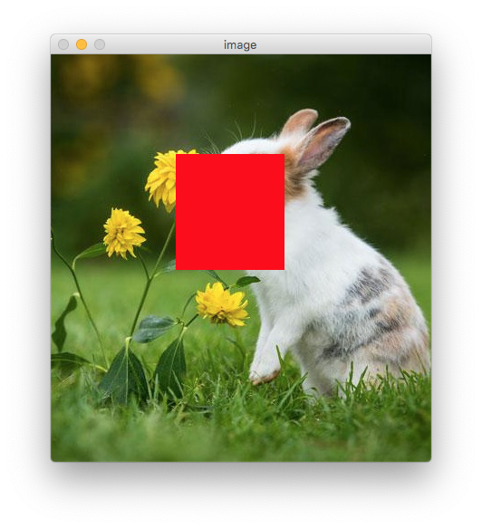
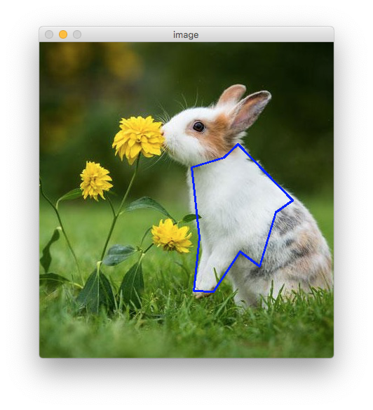
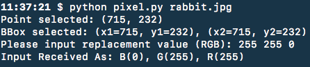

# Pixit

This is a simple image editor to fill a particular need. It currently has two
mode of editing: individual pixel and selected region of interest (defined as
ROI). The basic workflow is:
* select a pixel or a region of interest
* replace it with a new RGB value
* save the image

What not OpenCV? OpenCV has a function call `selectROI()` which allow you to
select a rectangle of region of interest as well. There are several problems
with it: 
* Multiple ROI operation doesn't seem to work
* Have no support `single pixel` operation
* Have no support of polygon ROI

Thus, this simple DIY script. Please report bugs/requests to [issues](https://github.com/aicip/pixit/issues).

## Set it up

This utility has two dependencies: Python 3 and OpenCV (3.x). The version
dependency is not critical: it can work under Python 2 with a bit tweak. 
Here is one way to set it up using Anaconda:

* Install [anaconda](https://www.anaconda.com/)
* Install OpenCV: `conda install opencv`
* Activate either the base or whatever the new environment you desire.

## Operations

To run it:

    python pixel.py rabbit.jpg

You need to switch between image window and console window for most operations:

|      Select ROI      | Replace with new value |
| :------------------: | :--------------------: |
|   |     |
|  |        |

* To quit: `ESC` key on the image window
* 'p' for selecting a point.
* 'r' for selecting a rectangular area of interest.
* 'P' for selecting a polygon, right click to end a selection.
* 'c' for canceling previous selection.
* Once a selection is made and ready to replace, on the image window, key in `R`, then go back to console window to type in new RGB value, such as `255
  0 0` and `Enter` to confirm.
* To save the image, key in `s` or `S` on the image window, console window will
  display the new image name, which is composed by old image base name, suffixed
 by `-new`.

